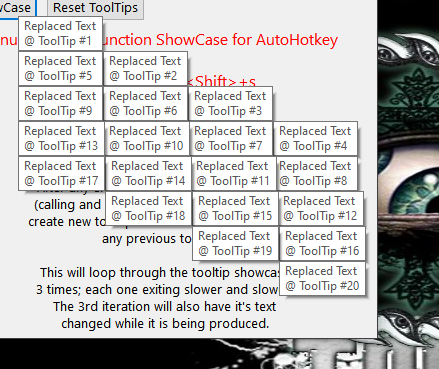

# AutoHotkey-EnumToolTips
Enumerate information about all current AutoHotkey tooltips. The function returns an enumerated index of objects with each tips window hwnd(id),string of text (text), x & y coordinates (x,y), and the width & height (w,h).                                                 

With each enumeration you can then set the coordinates and/or text of any new tooltips based on information from any existing tooltips.
## Instructions
The function is provided in the example file 'tooltips.ahk'. The function can be stripped from the example and used independantly.
### Files
[Example and Function](tooltips.ahk "tooltips.ahk example file")

[ScreenShot](Images/screen.png "Screenshot of example")
## Screen Shot

## Example Code - EnumToolTips Function
```
EnumToolTips(coordMode := "Screen"){
	tt := "ahk_class tooltips_class32"
	if (WinExist(tt)) {
		CoordMode,ToolTip,%coordMode%
		list := {}
		WinGet,ttList,List,%tt%
		loop,%ttList%
		{
			thisIdx := ((ttList-A_Index)+1)
			list[A_Index] := {}
			list[A_Index].id := ttList%thisIdx%
			workingID := "ahk_id " list[A_Index].id
			ControlGetText,thisText,,%workingID%
			WinGetPos,ttx,tty,ttw,tth,%workingID%
			list[A_Index].x := ttx
			list[A_Index].y := tty
			list[A_Index].w := ttw
			list[A_Index].h := tth 
			list[A_Index].text := thisText
		}
		CoordMode,ToolTip
		return list
	}
}
```
## Motivation
I wanted a better way of organizing AutoHotkey ToolTips; especially in an interface.
## Test
I have tested on Windows 10 64 Bit
## Contributors
Ian Pride @ faithnomoread@yahoo.com - [Lateralus138] @ New Pride Services 
## License
	This program is free software: you can redistribute it and/or modify
    it under the terms of the GNU General Public License as published by
    the Free Software Foundation, either version 3 of the License, or
    (at your option) any later version.

    This program is distributed in the hope that it will be useful,
    but WITHOUT ANY WARRANTY; without even the implied warranty of
    MERCHANTABILITY or FITNESS FOR A PARTICULAR PURPOSE.  See the
    GNU General Public License for more details.

	License provided in the License folder on the source page

